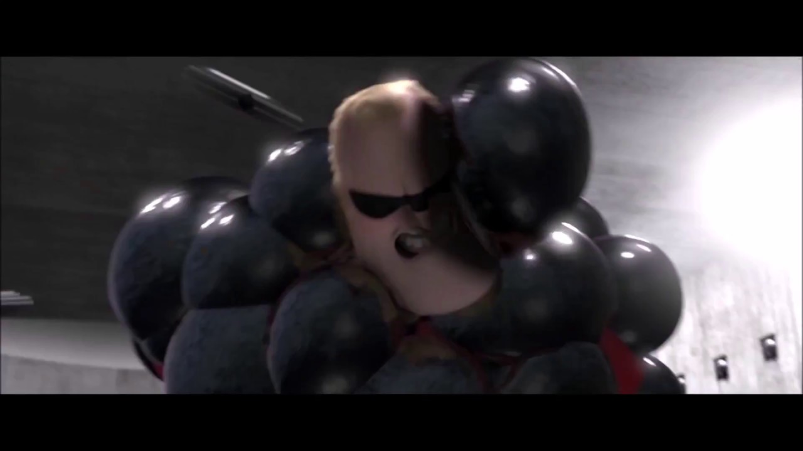
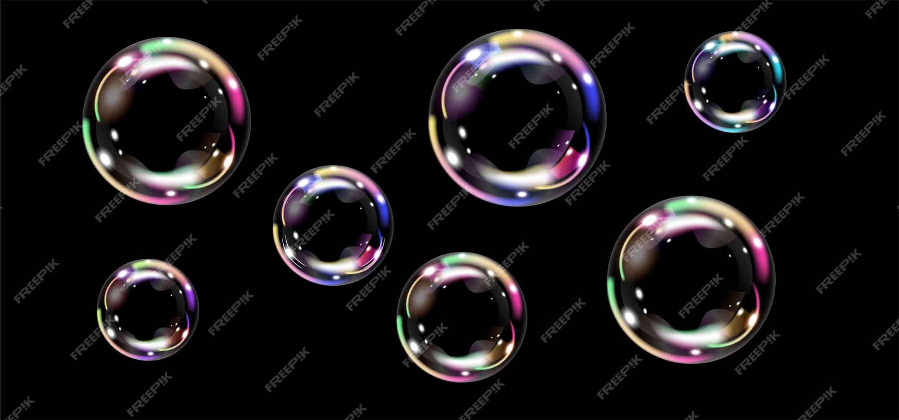

### 2024 MDDN342 Project 1: Parameterised Space

Bubbling Up
Felix Vidal

Design Intentions
Initially inspired by the classic game Snake, the project aimed to create an interactive scene where the screen gradually fills with lines (resembling snakes) moving around the space. However, the design intentions evolved over time, leading to the concept of bubbles appearing on the screen and gradually popping.

External Influences and Inspirations
3D Pipes Screensaver: The visual style of the project drew inspiration from the classic 3D pipes screensaver, particularly in terms of the dynamic movement and depth perception.

 However when that plan fell through I looked into other design ideas. One that I enjoyed was was the expanding black circles which I will mention in my journal. Some inspiration came from this scene in "The Incredibles".

Those black orbs then inspired me into a slightly different direction. The idea was bubbles.

Include reference images here

Design Journal
Part 1: Exploration and Inspiration
At the begining of project the concept was of a snake-like animation gradually filling the screen. Drawing inspiration from classic games and screensavers, particularly the 3D pipes screensaver, I aimed to create a visually engaging experience with dynamic movement and depth perception.

Part 2: Iteration and Realization
Initial attempts involved creating a grid on the canvas and generating a line that traversed the screen, simulating a snake-like motion. However, limitations in the timeframe led to a reassessment of the approach. Recognizing the constraints, I pivoted towards exploring alternative concepts while still maintaining the essence of dynamic animation.

Part 3: Experimentation and Refinement
Exploring new avenues, I experimented with different visual elements, including circles expanding from a central point resembling an explosion. While visually interesting, the complexity of the animation led to a chaotic experience. Iterating further, I developed a grid of circles across the canvas, utilizing noise functions to control their expansion and contraction. This iterative process allowed for refinement and optimization of the visual effects.

Part 4: Evolution and Finalization
Refining the design, I simplified the color scheme to black background with white circles, reminiscent of bubbles. Implementing a rainbow ring around each circle added a touch of chromatic aberration, enhancing the bubble-like appearance. Further modifications were made to simulate the popping of bubbles based on the progression of the animation. The addition of randomization in circle placement added variation and visual interest to the scene, resultoinig in the design concept.

Overall, the design process was marked by experimentation, iteration, and adaptation, ultimately resulting in the creation of a dynamic and visually captivating animation reminiscent of bubbles emerging and popping.

References:

Pipes: https://www.screensaversplanet.com/screensavers/3d-pipes-494/#google_vignette
Incredibles: Bird, B. (2004). The Incredibles. Buena Vista Pictures.
Bubbles: [Katia_d](https://www.freepik.com/author/katiad)